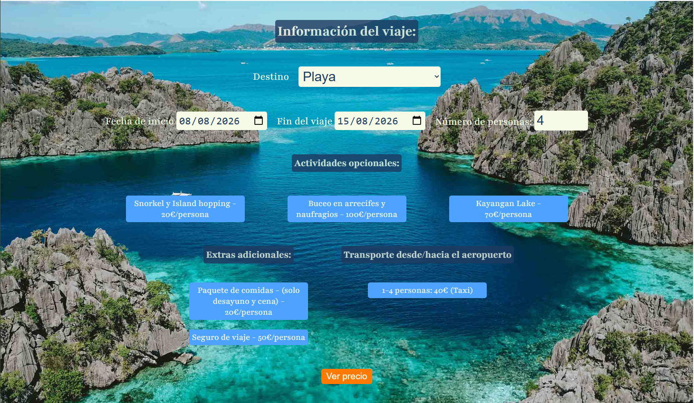
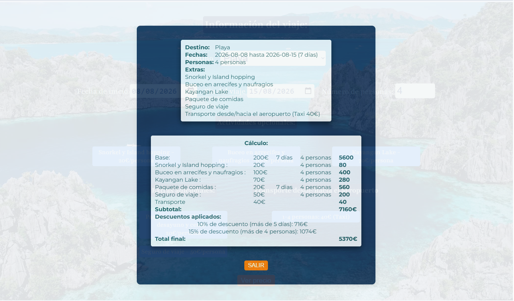

# 🌍 Isla Viajes & Aventuras

A responsive travel agency website developed as a frontend web development training project.

The project simulates a travel booking experience where users can select a destination, choose different travel options, and receive a dynamically calculated price based on their selections.

🔗 **Live Demo:** https://islaviajesyaventuras.netlify.app/

---

## 📌 Project Overview

**Isla Viajes & Aventuras** is a frontend travel agency website focused on creating an interactive and user-friendly booking experience.

The project uses HTML, CSS, and JavaScript to create:

- Responsive travel pages
- An interactive booking form
- Client-side form validation
- Dynamic destination and option selection
- Automatic price calculation
- Additional travel options and discounts
- A responsive layout for desktop and mobile devices

The booking functionality is a **simulation** and does not process real reservations or payments.

---

## 🖼️ Preview

### 🏝️ Home Page


### 📝 Booking Form


### 💰 Booking Summary & Price Calculation


> Screenshots show the main interface, booking form, and dynamically calculated booking summary.

---

## ✨ Features

- 🌍 Select travel destinations dynamically
- 📝 Interactive booking form
- ✅ Client-side form validation
- 💰 Dynamic price calculation using JavaScript
- 🎟️ Automatic discounts based on selected options
- ➕ Additional travel options and extras
- 📱 Responsive design for mobile and desktop
- 🎨 Clean and user-friendly interface
- 🔄 Dynamic updates based on user selections

---

## ⚙️ How It Works

The website guides the user through a simulated booking process:

1. The user selects a travel destination.
2. Available travel options are selected through the booking form.
3. JavaScript reads the selected values.
4. The application calculates the corresponding price.
5. Discounts and additional options are applied when applicable.
6. The booking summary is updated dynamically.
7. Form validation prevents incomplete or invalid submissions.

All calculations and interactions are handled on the client side using JavaScript.

---

## 🛠️ Technologies Used

### Frontend

- **HTML5** – Page structure and semantic content
- **CSS3** – Styling, layout, and responsive design
- **JavaScript (ES6+)** – Interactivity, DOM manipulation, events, validation, and price calculation

### Concepts Practiced

- DOM manipulation
- JavaScript events
- Form handling
- Form validation
- Conditional logic
- Dynamic content updates
- Responsive web design
- CSS Flexbox
- Client-side calculations

---

## 📂 Project Structure

```text
Isla-Viajes-y-Aventuras/
│
├── index.html
├── paris.html
├── suiza.html
├── coron.html
│
├── css/
│   └── ...
│
├── js/
│   └── ...
│
└── img/
    └── ...

---

## 🎯 Project Purpose

This project was created as part of my frontend web development training to practice building an interactive website using HTML, CSS, and JavaScript.

The main focus was on applying JavaScript to a practical user interface, particularly:

Handling user input
Validating forms
Responding to user events
Manipulating the DOM
Performing dynamic calculations
Creating a responsive interface

---

## 🌐 Language

The website interface is in Spanish, while the project documentation is provided in English.

---


## 👩‍💻 Author

Manelynp

GitHub: https://github.com/Manelynp

---
